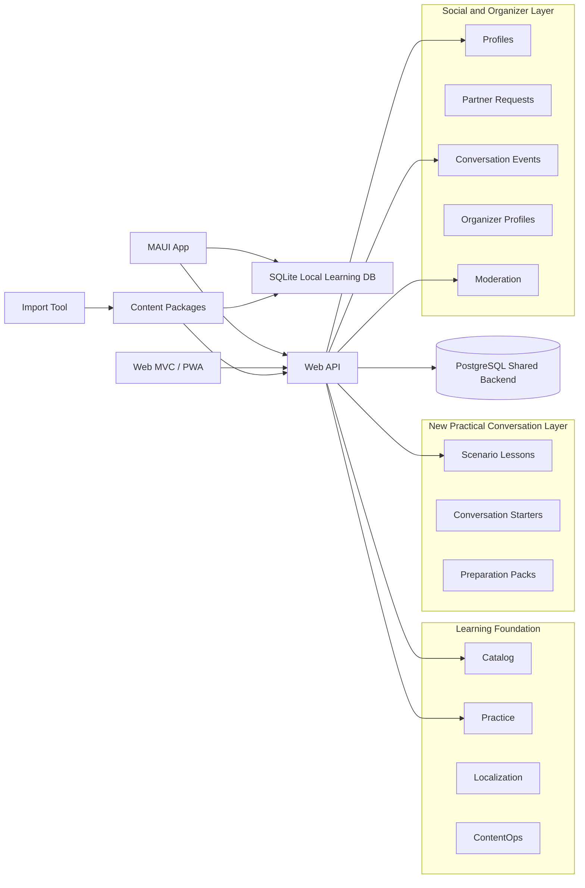
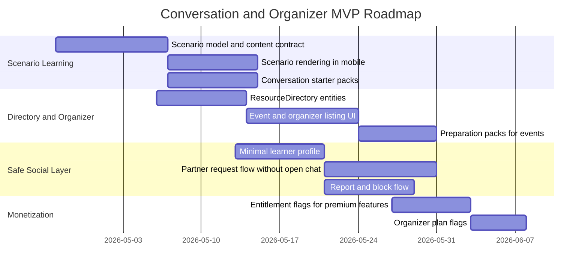

# Market, Product, and Organizer Strategy

## Purpose

This document captures the product and business strategy for the next Darwin Lingua expansion wave.

It focuses on:

- the market opportunity for a practical German-learning product in Germany
- multilingual and dual-meaning-language learning as a product differentiator
- scenario-based dialogue learning and conversation starters
- safe learner profiles and conversation-partner discovery
- conversation cafes, clubs, local events, and B2B organizer tools
- freemium and low-cost subscription options
- safety, privacy, moderation, and implementation boundaries

This is a product strategy document, not an implementation specification. The executable backlog for this direction is tracked in `64-Conversation-And-Organizer-Implementation-Backlog.md`.

---

## Executive Summary

Darwin Lingua should not compete as another generic German-learning app.

The stronger positioning is:

> Practical German for real life in Germany, supported by multilingual explanations, guided dialogue practice, and safe access to people and events for conversation practice.

The current technical foundation already supports a strong content-first learning product: local-first mobile storage, content packages, multilingual meanings, vocabulary detail screens, practice state, server content distribution, web platform planning, identity, and entitlement direction.

The next strategic step is to add a higher-level product layer on top of the existing lexical and practice foundation:

1. scenario-based German learning
2. conversation starters and topic packs
3. dual meaning-language learning such as `German + English + Persian`, `German + English + Arabic`, or `German + English + Turkish`
4. local conversation cafes and event discovery
5. safe learner profiles and lightweight matching
6. B2B organizer tools for clubs, teachers, cafes, and integration groups

The key business point is simple: a `1-2 EUR/month` learner subscription can help, but it will not create meaningful revenue unless monthly active users grow significantly. A lightweight B2B organizer tier can stabilize revenue earlier because a small number of organizers can produce more predictable monthly revenue than many low-price learner subscriptions.

---

## Product Positioning

### Recommended Positioning

Darwin Deutsch should be positioned as:

> German for real situations in Germany.

More specifically:

> A practical German-learning app for immigrants, newcomers, international students, foreign workers, and multilingual learners who need usable German for work, daily life, offices, school, healthcare, housing, and social contact.

### What Not To Position It As

Do not position Darwin Deutsch primarily as:

- a Duolingo clone
- a generic vocabulary list
- a grammar-only course
- a social network
- a dating-style language app
- a full tutoring marketplace

Those categories are either saturated, too broad, or operationally expensive.

### Core Wedge

The recommended wedge is:

> Real-life German scenarios plus safe conversation practice.

The learner should open the app because they have a concrete situation:

- I need to speak with a doctor.
- I need to write to a kindergarten or school.
- I need to call an office.
- I need to talk to a landlord.
- I need to start a conversation with someone in a language cafe.
- I need a conversation partner near me or online.

---

## Dual Meaning-Language Strategy

### Product Idea

Darwin Lingua should support learning German through two meaning languages at the same time.

Examples:

- German + English + Persian
- German + English + Arabic
- German + English + Turkish
- German + English + Ukrainian
- German + English + Russian

This is not just a translation feature. It is a learning strategy.

### Why It Matters

Many learners in Germany use English for study, work, software, university, and international communication, while still understanding complex ideas faster through their native language.

If they learn German only through their native language, their English may gradually become less active. If they learn German only through English, comprehension may be slower for complex situations.

Dual meaning-language learning solves this:

- native language improves speed and emotional clarity
- English maintains academic and professional language continuity
- German remains the target language
- the learner can compare expressions across all three languages

### UX Principle

The learner should be able to select:

- primary meaning language
- secondary meaning language
- UI language
- optional compact or expanded translation layout

Example layout:

| German | English | Persian |
|---|---|---|
| Ich möchte einen Termin vereinbaren. | I would like to make an appointment. | می‌خواهم یک وقت بگیرم. |

The system should treat this as a first-class learning mode, not as an afterthought.

---

## Market Segments

The most relevant early segments are not all German learners worldwide. The relevant segments are people in Germany who need practical German now.

| Segment | Need | Product Fit |
|---|---|---|
| Immigrants and newcomers | Daily German, offices, healthcare, housing, school, work | Very high |
| Refugees and integration-course learners | Practical language plus local support | Very high |
| International students | German for daily life while maintaining English | High |
| Foreign workers | Workplace German, emails, calls, social integration | High |
| Parents with children in Germany | Kita, school, doctor, appointments | High |
| Language cafe participants | Conversation preparation and follow-up | Very high |
| Teachers and volunteers | Ready-made practical scenario packs | Medium to high |
| Organizers and clubs | Event visibility, attendance, participant preparation | High B2B potential |

---

## Realistic Monthly Active User Scenarios

These numbers are planning scenarios, not guaranteed forecasts.

| Stage | Product State | Realistic MAU |
|---|---:|---:|
| Early MVP | Basic content, limited distribution | 100-500 |
| Useful first release | Scenarios, vocabulary, practice, search | 500-2,000 |
| Practical immigrant-focused product | Real-life scenario packs and multilingual support | 2,000-10,000 |
| Community-enabled product | Profiles, partner requests, events, organizers | 10,000-50,000 |
| Strong distribution and partnerships | Multilingual depth plus active organizer network | 50,000+ |

A more conservative working target:

| Time Horizon | Reasonable Target |
|---|---:|
| First 6 months after public release | 500-2,500 MAU |
| 6-18 months | 2,000-8,000 MAU |
| 18-36 months | 8,000-25,000 MAU |
| Strong upside scenario | 25,000-60,000 MAU |

The product should not be financially planned around 50,000 MAU from the beginning. That would be unrealistic without strong distribution, partnerships, or paid acquisition.

---

## Competitor Landscape

| Category | Examples | Strength | Gap Darwin Lingua Can Use |
|---|---|---|---|
| Generic language apps | Duolingo, Babbel, Busuu | Strong brand, habit loops, polished apps | Less focused on real-life German in Germany and local conversation practice |
| Public/free German resources | DW Learn German, public materials | Trustworthy, free, broad | Less personalized, less community-linked, less dual-language focused |
| Language exchange apps | Tandem, HelloTalk | People matching and chat | Safety, local German scenarios, and structured preparation can be weaker |
| Event platforms | Meetup, Eventbrite, local groups | Event discovery and attendance | Not built for language-learning preparation and follow-up |
| Language schools and tutors | Local schools, private teachers | Human instruction | Higher cost and less continuous daily self-practice |

The opportunity is not to beat every competitor at their own game. The opportunity is to combine practical scenario learning with safe conversation discovery.

---

## Scenario-Based Learning

### Core Concept

A `ScenarioLesson` should represent a real situation, not only a vocabulary group.

Examples:

- Visiting a doctor
- Calling a school
- Talking to a kindergarten teacher
- Asking for an apartment viewing
- Speaking with an immigration office
- Introducing yourself at a conversation cafe
- Talking with colleagues during lunch
- Asking for help in a shop
- Making a complaint politely
- Rescheduling an appointment

### Scenario Content Template

| Block | Description |
|---|---|
| Title | Clear real-life situation |
| Goal | What the learner should be able to do afterward |
| CEFR range | A1, A2, B1, B2, etc. |
| Context | Formal, informal, phone, office, workplace, social |
| Dialogue | 6-12 realistic turns |
| Key vocabulary | Essential words and phrases |
| Conversation starters | Ready-to-use opening phrases |
| Likely questions | Questions the learner may hear or ask |
| Useful answers | Safe and simple answer examples |
| Politeness notes | Formal/informal, direct/indirect tone |
| Mistake warnings | Common learner mistakes |
| Roleplay mode | Role A, Role B, success criteria |
| Follow-up practice | Flashcards, quiz, replay, saved phrases |

### Example Scenario

#### Scenario

First meeting for language practice in a cafe.

#### Goal

The learner can introduce themselves, explain their German level, suggest a topic, ask for gentle correction, and arrange a next meeting.

#### Dialogue

| German | English | Persian |
|---|---|---|
| Hi, ich bin Shahram. Schön, dich kennenzulernen. | Hi, I am Shahram. Nice to meet you. | سلام، من شهرام هستم. خوشحالم که می‌بینمت. |
| Ich übe Deutsch seit Kurzem ernsthafter. | I have recently started practicing German more seriously. | من تازگی‌ها آلمانی را جدی‌تر تمرین می‌کنم. |
| Ich möchte gern über Arbeit, Alltag und die Stadt sprechen. | I would like to talk about work, daily life, and the city. | دوست دارم درباره کار، زندگی روزمره و شهر صحبت کنم. |
| Wenn ich Fehler mache, korrigiere mich bitte freundlich. | If I make mistakes, please correct me gently. | اگر اشتباه کردم، لطفاً آرام و دوستانه اصلاحم کن. |
| Übst du lieber persönlich oder online? | Do you prefer practicing in person or online? | ترجیح می‌دهی حضوری تمرین کنیم یا آنلاین؟ |
| Wenn es gut läuft, können wir uns nächste Woche wieder treffen. | If it goes well, we can meet again next week. | اگر خوب پیش برود، می‌توانیم هفته بعد دوباره همدیگر را ببینیم. |

#### Conversation Starters

| German | English | Persian |
|---|---|---|
| Wollen wir mit einer einfachen Vorstellungsrunde anfangen? | Shall we start with a simple introduction round? | با یک معرفی ساده شروع کنیم؟ |
| Über welche Themen sprichst du gern? | What topics do you like talking about? | دوست داری درباره چه موضوع‌هایی صحبت کنی؟ |
| Können wir heute langsam und einfach sprechen? | Can we speak slowly and simply today? | می‌توانیم امروز آرام و ساده صحبت کنیم؟ |
| Soll ich dich direkt korrigieren oder erst am Ende? | Should I correct you directly or at the end? | مستقیم اصلاحم کنی یا آخر صحبت؟ |

---

## B2B Organizer Strategy

### Definition

A B2B organizer is any person or organization that runs language-related meetings, groups, classes, or conversation events.

Examples:

- conversation cafes
- language clubs
- independent German teachers
- migrant support groups
- student associations
- libraries
- integration organizations
- cultural centers
- companies with foreign employees

The strategy is to give organizers a lightweight toolset so they can publish events, manage attendance, and help participants prepare.

### Why It Matters

A low-cost learner subscription can work only with significant MAU. Organizer revenue can become meaningful earlier.

Example:

| Revenue Source | Scenario | Monthly Revenue |
|---|---:|---:|
| Learner subscriptions | 10,000 MAU x 3% conversion x 2 EUR | 600 EUR |
| Organizer Lite | 50 organizers x 9 EUR | 450 EUR |
| Organizer Standard | 50 organizers x 19 EUR | 950 EUR |

The organizer layer should therefore be treated as a revenue stabilizer, not just a nice-to-have feature.

### Organizer Functionalities

| Functionality | Business Value |
|---|---|
| Organizer profile | Gives each club, teacher, or group a public page |
| Event creation | Lets organizers list sessions without manual admin work |
| Recurring events | Useful for weekly conversation cafes |
| RSVP | Shows expected attendance and capacity |
| Participant list | Helps organizers prepare sessions |
| Level and language filters | Matches the right learners to the right event |
| Preparation pack | Differentiates Darwin Lingua from generic event platforms |
| Attendance feedback | Improves quality and trust |
| Verified organizer badge | Builds trust and reduces spam |
| Featured listing | Creates monetization without blocking learners |
| Analytics | Shows views, RSVP count, attendance, and conversion |

### Organizer Plans

| Plan | Price Idea | Target User | Features |
|---|---:|---|---|
| Free Organizer | 0 EUR | New or small group | Public page, limited active events, basic listing |
| Organizer Lite | 9 EUR/month | Teacher or small cafe | More events, basic analytics, RSVP, city listing |
| Organizer Standard | 19 EUR/month | Active club or organization | Recurring events, attendee export, featured city placement, verified badge |
| Organizer Pro | 39 EUR/month | Larger organization | Multiple admins, multiple locations, richer analytics, branded profile |

The first implementation should not include full payment handling if that slows launch. It can start with plan flags and manual admin assignment.

---

## Event and Preparation Pack Model

The main product differentiation is not only showing events. The differentiation is helping learners prepare for the event.

### Example Event

| Field | Example |
|---|---|
| Event | German Speaking Cafe for Beginners |
| Level | A1-A2 |
| Languages supported | English, Persian, Arabic |
| Topic | Everyday conversations |
| Capacity | 15 |
| Price | Free or donation-based |
| Location | Hamburg-Altona |
| Time | Every Friday, 18:00 |

### Preparation Pack

For every event, the app can generate or attach:

- 20 useful words
- 10 opening sentences
- 5 short dialogues
- 10 fallback phrases for when the learner gets stuck
- roleplay exercises
- post-event review prompts

This is the product bridge between learning and community.

---

## Safety and Privacy Principles

The social layer must be conservative. This is not optional.

### MVP Safety Rules

| Area | Rule |
|---|---|
| Age | In-person matching should be 18+ unless a dedicated minor-safe model is designed |
| Location | Show city or area only, never exact home location |
| Profile | Do not expose phone, email, or exact address publicly |
| Matching | Require mutual opt-in before contact sharing |
| Messaging | Avoid unrestricted free-form direct messaging in the MVP |
| Abuse control | Include report, block, mute, and rate limits from the start |
| Organizer trust | Require review or verification for recurring public organizers |
| Moderation | Provide an admin review queue for reports and public listings |
| Data policy | Support data minimization, deletion, and export planning |

### Messaging Recommendation

Do not build a full chat system in the first version.

Instead:

1. allow a user to send a partner request
2. use predefined opener templates
3. require accept or decline
4. reveal external contact only after mutual consent, or keep messaging very limited
5. add report/block everywhere

This avoids turning the product into an unsafe or moderation-heavy social network too early.

---

## Monetization Strategy

### Free Tier

Keep the core useful.

Free should include:

- browse and search
- basic vocabulary details
- many scenario lessons
- limited favorites or saved phrases
- read-only event directory
- basic profile
- limited match requests

### Learner Plus

Suggested starting price: `1.99 EUR/month`.

Possible benefits:

- unlimited saved phrases
- more scenario packs
- dual-language advanced layout
- more review history
- more partner requests
- better filters
- preparation packs for events

### Learner Pro

Possible later price: `4.99 EUR/month`.

Possible benefits:

- AI-assisted roleplay feedback
- email/message writing practice
- job interview practice
- office/doctor/school scenario packs
- personalized learning path

### Organizer Plans

Organizer plans should start cheaper than broad event platforms and be language-learning-specific:

- Free Organizer
- Organizer Lite: about `9 EUR/month`
- Organizer Standard: about `19 EUR/month`
- Organizer Pro: about `39 EUR/month`

---

## Product Architecture Fit

The current solution direction can support this expansion without a full rewrite.

Recommended new bounded contexts or modules:

- `Scenarios`
- `Profiles`
- `Matching`
- `ResourceDirectory`
- `Events`
- `Organizers`
- `Moderation`
- `Entitlements`

The existing `Catalog`, `Learning`, `Practice`, `ContentOps`, and `Localization` contexts should remain the learning foundation.

### Proposed Architecture Diagram

---

## MVP Roadmap

---

## KPI Targets

Track only a small number of meaningful metrics at first.

| Metric | Why It Matters |
|---|---|
| Scenario completion rate | Shows whether practical lessons are useful |
| 7-day retention | Shows whether learners return after first use |
| 30-day retention | Shows whether the product becomes a habit |
| Saved phrases per user | Shows real utility |
| Match request to accept rate | Shows whether partner discovery works |
| Event view to RSVP rate | Shows event-market fit |
| Organizer activation rate | Shows B2B viability |
| Report rate per active user | Shows safety risk |

---

## Source Notes

The market direction in this document was informed by public market and product references reviewed during planning, including:

- German Federal Statistical Office data on foreign population in Germany
- BAMF integration-course statistics
- DAAD reporting on international students in Germany
- Duolingo public product and investor information
- Babbel public subscription information
- Meetup organizer pricing information

These references should be refreshed before using this document for investor material, pricing pages, or public claims.

---

## Final Recommendation

Build this expansion in this order:

1. scenario lessons and conversation starters
2. event and club directory
3. preparation packs for events
4. organizer profiles
5. safe learner profiles
6. request-based partner matching without open chat
7. moderation and abuse controls
8. entitlement flags and low-cost premium features
9. organizer self-service and paid plans

Do not start with a full social network. Do not start with unrestricted chat. Do not hide the core value behind a heavy paywall.

The product should first become useful, trusted, and safe. Monetization should then sit on convenience, advanced practice, better matching, and organizer tooling.